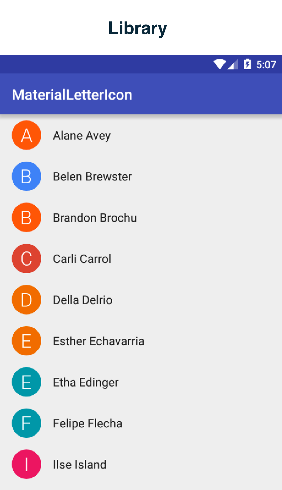
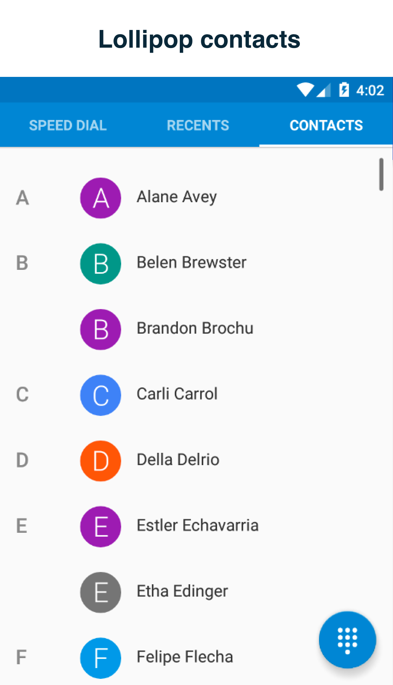
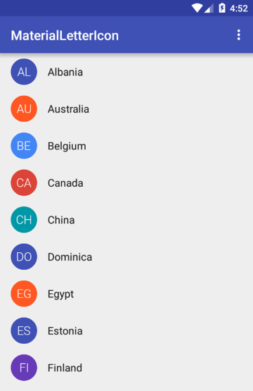
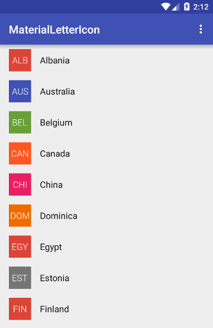

Material Letter Icon
====================

Material letter icon with shape background. Replicates android L contacts icon view.

[](http://android-arsenal.com/details/1/2633) [](https://travis-ci.org/IvBaranov/MaterialLetterIcon)




Variations
----------



Download
--------

```groovy
compile 'com.github.ivbaranov:materiallettericon:0.2.1'
```


Usage
-----

Declare in XML (see xml attributes below for customization):

```xml
<com.github.ivbaranov.mli.MaterialLetterIcon
    android:layout_width="@dimen/letter_icon_size"
    android:layout_height="@dimen/letter_icon_size" />
```

Or static initializer (see xml attributes below for customization):

```java
MaterialLetterIcon icon = new MaterialLetterIcon.Builder(context) //
            .shapeColor(getResources().getColor(R.color.circle_color))
            .setShapeType(MaterialLetterIcon.SHAPE_CIRCLE)
            .letter("S")
            .letterColor(getResources().getColor(R.color.letter_color))
            .letterSize(26)
            .lettersNumber(1)
            .letterTypeface(yourTypeface)
            .initials(false)
            .initialsNumber(2)
            .create();
```


Configure using xml attributes or setters in code:

```java
app:mli_shape_color="@color/black"      // shape color
app:mli_shape_type="circle"             // shape type
app:mli_letter=""                       // letter or string to get first letter from
app:mli_letter_color="@color/white"     // letter color
app:mli_letter_size="26"                // letter size SP
app:mli_letters_number="1"              // number of letters to get from string
app:mli_initials="false"                // turn on initials mode
app:mli_initials_number="2"             // number of initials to be showed
```


Developed By
------------
Ivan Baranov

License
-------

```
Copyright 2015 Ivan Baranov

Licensed under the Apache License, Version 2.0 (the "License");
you may not use this file except in compliance with the License.
You may obtain a copy of the License at

   http://www.apache.org/licenses/LICENSE-2.0

Unless required by applicable law or agreed to in writing, software
distributed under the License is distributed on an "AS IS" BASIS,
WITHOUT WARRANTIES OR CONDITIONS OF ANY KIND, either express or implied.
See the License for the specific language governing permissions and
limitations under the License.
```
